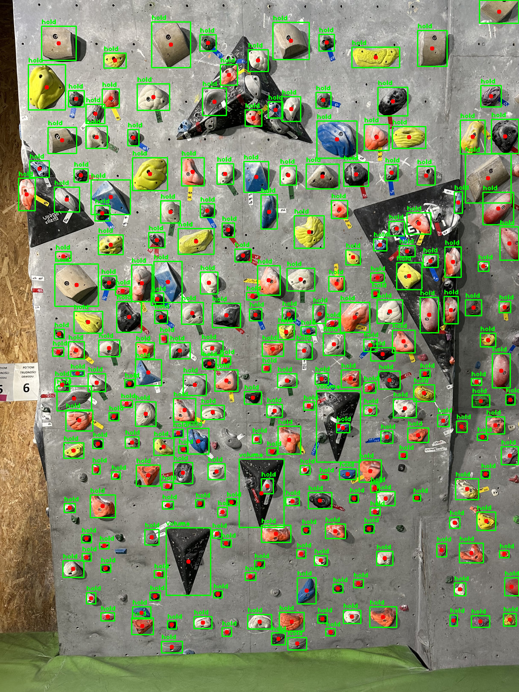

# Climbing Crux Model

The climbing crux model is a machine-learning project that aims to recognize climbing holds and the distance between them from a photo and suggest routes that fit the user's climbing level.

The model recognizes climbing holds and volumes from a photo using the YOLOv9 object detection algorithm. The model is trained on a custom dataset containing photos of climbing walls and annotations in the YOLO format.



## Setup

To run the project, you need to have Python 3.11 and the required packages installed. You can install the required packages using the following command:

### Install pyenv and Python 3.11
```bash
$ curl https://pyenv.run | bash
$ pyenv install 3.11.8
```

### Turn on pyenv
```bash 
$ pyenv shell 3.11.8
```

### Install poetry and the required packages
```bash
$ python -m pip install poetry
$ poetry install
```

### Turn on the virtual environment
```bash
$ poetry shell
```

### Create `env` file by copying the example and update the model path

```bash
$ cp .env.dist .env
$ nano .env
```

### Turn on the Jupyter Lab
```bash
$ jupyter-lab
```

## Data

To achieve the goal of this project, I will use photos from a private collection of climbing walls. You can download the dataset from the link below. It also contains photos and the annotations in the YOLO format.

* [Download the dataset](https://drive.google.com/file/d/1JBzTWpQVjzBkB_mmd7ztzu2ifw78tLrx/view?usp=sharing)

## Distance detection

The distance between climbing holds is calculated using the distance between the centers of the bounding boxes of the detected climbing holds. The distance is calculated in pixels and then converted to centimeters using the reference to aruco marker.

* [Used marker](./resources/aruco_marker_5x5_200px.png)


## Metrics for object detection

The model is evaluated using the following metrics:

mAP (mean Average Precision) - the average of the precision-recall curves at different IoU thresholds.

* map50-95 - 0.8216387037838236
* map50 - 0.9298378191260248
* map75 - 0.8925210764855455

## Model

You can download the trained model from the link below.

* [Download the model](https://drive.google.com/file/d/1n2eCwIOLOGnisuqwGP7IY1-T6J1YNScu/view?usp=sharing)

## Useful links

* [Train Yolov8 object detection on a custom dataset](https://www.youtube.com/watch?v=m9fH9OWn8YM)
* [Object Detection with YOLO v8 on Mac M1](https://www.youtube.com/watch?v=kEcWUZ8unmc)
* [Online Annotation Platform](https://www.cvat.ai/)

## License

This project is licensed under the MIT License - see the [LICENSE](LICENSE) file for details.
